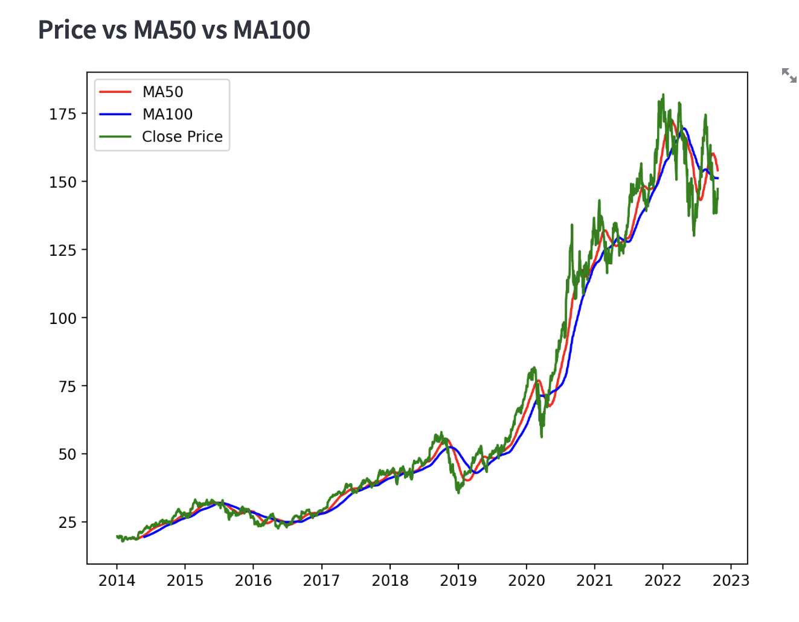

# Stock Market Prediction Project 📈

This project predicts stock prices using historical data and machine learning models. It leverages financial data from Yahoo Finance to train and test a neural network model for time-series forecasting. The model is deployed using Streamlit, a Python-based web framework, to provide a user-friendly interface for users to input stock symbols and view predictions.

## Project Structure
app.py: The main application code, which defines the user interface using Streamlit and displays stock data, moving averages, and predictions.

Stock Predictions Model.keras: The saved machine learning model, trained on stock data, used for making predictions.

Stock_Market_Prediction_Model_Creation.ipynb: The Jupyter Notebook containing the code used to build, train, and save the neural network model.

## Tech Stack and Libraries Used
1. Python
Core programming language for building the application, processing data, and training the model.

2. Streamlit
Web application framework for deploying the machine learning model with a user interface.
Command to run the app:

3. Yahoo Finance (yfinance)
Used to download historical stock market data.

4. Keras
High-level neural networks API, part of TensorFlow, for building and loading the LSTM model used for prediction.

5. Matplotlib
Visualization library for plotting stock prices and moving averages.

6. scikit-learn (MinMaxScaler)
Used for scaling stock price data between 0 and 1 to improve model training performance.

7. NumPy & Pandas
NumPy: For numerical computations.
Pandas: For data manipulation and handling time-series data.
## Features and Workflow
### Data Collection

The application allows users to input a stock symbol (e.g., GOOG for Google).
It fetches historical data from Yahoo Finance using yfinance for the given stock symbol over the date range 2014-01-01 to 2022-10-24.
### Data Preprocessing

The data is split into:
Training Data: 80% of the total data.

Testing Data: The remaining 20%, with 100 past days added for prediction continuity.
MinMaxScaler is used to scale the data between 0 and 1 for better neural network performance.

### Model Prediction

The LSTM (Long Short-Term Memory) model is loaded from the saved Keras model (Stock Predictions Model.keras).
The model uses the previous 100 days of scaled stock prices to predict future prices.
Visualization

The app visualizes stock prices using Matplotlib and Streamlit.

### Plots include:
- Price vs 50-Day Moving Average (MA50)
- Price vs 50-Day and 100-Day Moving Averages (MA50 & MA100)
- Price vs 100-Day and 200-Day Moving Averages (MA100 & MA200)
- Original vs Predicted Stock Prices

## Interface

Users can input a stock symbol and view the data, predictions, and moving averages interactively through the Streamlit web app.

## Potential Improvements

1. Add more stock indicators (e.g., RSI, Bollinger Bands) for better predictions.

2. Train the model on live data for real-time predictions.

## Conclusion
This project demonstrates how to combine machine learning with financial data to predict stock prices. It uses Streamlit for an interactive interface and Keras to build an LSTM model for time-series forecasting. Users can input stock symbols and visualize both historical trends and predicted prices, making it a great starting point for financial forecasting tools.

## Screenshots 

